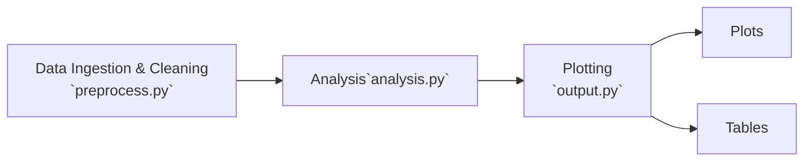

# pycone

Pycone is a conifer data analysis toolkit written in Python. Pycone is
maintained by the [Greene research group](https://ffrm.humboldt.edu/people/david-greene)
at Cal Poly Humboldt.

## Installation

`pycone` is a Python package, so you'll need python installed on your system.
Once that's done, clone this repository from the terminal and install `pycone`
as a package:

```bash
git clone https://github.com/peytondmurray/pycone.git
cd pycone
pip install .
```

This will install the necessary dependencies for the project, and allow you to
run the code; the dependencies are specified in `pyproject.toml`.

## Running the code

```python
import pycone

cones, weather = pycone.preprocess.load_data()
mean_t = pycone.analysis.calculate_mean_t(weather)
```

## Development

To pull in the development dependencies:

```bash
pip install -e .[dev]
```

Here, `[dev]` adds the optional dependencies that are specified in
`pyproject.toml`, and `-e` installs the package in ["editable"
mode](https://pip.pypa.io/en/stable/cli/pip_install/#cmdoption-e).

## Testing

Install the development dependencies, then run

```bash
pytest
```

to run all the tests. Tests are also run as part of continuous integration (CI),
which runs every time someone makes a pull request.

## Package Structure


